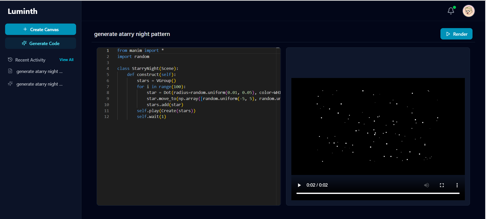
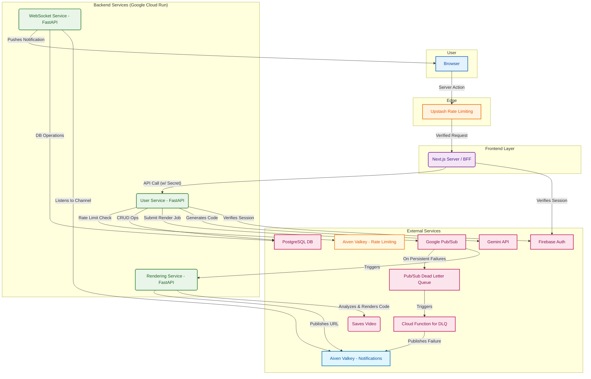

# Luminth: AI-Powered Manim Animation Studio

Luminth is a full-stack, cloud-native web application that allows you to generate, edit, and render beautiful mathematical animations with the power of AI. By leveraging Google's Gemini API, you can describe an animation in plain English, and Luminth will generate the corresponding Python code for the Manim engine, or you can create a canvas and write your own Manim script. The platform features a robust, secure, and scalable microservices architecture designed for a seamless user experience from code creation to final video rendering.

-----

## ✨ Key Features

  * **AI-Powered Code Generation**: Utilizes the Google Gemini API to translate natural language prompts into Manim animation code.
  * **Cloud-Based Asynchronous Rendering**: A scalable, non-blocking rendering pipeline built with Google Cloud Pub/Sub and Cloud Run.
  * **Interactive Code Editor**: An in-browser editor powered by Monaco Editor (the engine behind VS Code) for a familiar coding experience.
  * **Real-Time Notifications**: Users receive instant updates on their rendering jobs via a WebSocket service.
  * **Secure Authentication**: End-to-end user authentication and session management using Firebase Authentication and secure session cookies.
  * **Defense-in-Depth Security**: Multi-layered security approach including API secrets, rate limiting, and static code analysis.
  * **Fully Responsive UI**: A modern, clean interface built with Next.js and Tailwind CSS, featuring both Light and Dark Modes.
  * **Monorepo Architecture**: A clean and maintainable codebase managed with NX.

-----

## 🏛️ System Architecture

Luminth is built on a distributed microservices architecture following the Backend-for-Frontend (BFF) pattern. This design decouples the frontend from the backend services, enhancing scalability and separation of concerns.



### Workflow Breakdown

1.  **Frontend Interaction**: The user interacts with the Next.js application. API requests are sent as Server Actions, which are first processed by Upstash for rate limiting.
2.  **BFF Layer (Next.js)**: The Next.js server validates the user's session cookie with Firebase. It acts as the sole gateway to the backend, forwarding authenticated requests with a secret API key to the appropriate microservice.
3.  **User Service**: A FastAPI service that handles all user-related operations, interacting with the PostgreSQL database. It has its own rate limiting logic using a centralized Aiven for Valkey (Redis) instance to maintain state across multiple Cloud Run instances.
4.  **Rendering Pipeline**:
      * When a user submits code, it is published as a job to a Google Cloud Pub/Sub topic.
      * This message triggers the Rendering Service (FastAPI on Cloud Run, configured with `concurrency=1` for secure, isolated execution).
      * The service performs static analysis on the code, renders the video using Manim, and uploads the result to Dropbox.
      * Upon completion (or failure), a message with the video URL is published to a Redis channel.
5.  **Real-Time Notifications**: The WebSocket Service (FastAPI) listens to the Redis channel and pushes a notification to the user's browser, providing a seamless, real-time experience.

-----

## 🛠️ Tech Stack

| Category | Technology / Service |
| :--- | :--- |
| **Frontend** | Next.js, React, Tailwind CSS, Monaco Editor, DiceBear |
| **Backend** | FastAPI (Python 3.11+), SQLModel, Pydantic |
| **Package Management** | npm (Frontend), uv (Backend) |
| **Database** | PostgreSQL |
| **Authentication** | Firebase Authentication |
| **Infrastructure** | Google Cloud Run, Google Cloud Pub/Sub, Docker |
| **State & Messaging** | Aiven for Valkey (Redis), Google Cloud Pub/Sub |
| **CI/CD & Tooling**| GitHub Actions, NX Monorepo |
| **AI & Storage** | Google Gemini API, Dropbox API |

-----

## 📂 Project Structure

This project is a monorepo managed by NX. This structure improves code sharing, atomic commits, and maintainability.

```
/
├── apps/
│   ├── frontend/         # Next.js BFF and UI
│   ├── user-service/     # FastAPI User Service
│   ├── rendering-service/# FastAPI Rendering Service
│   └── websocket-service/# FastAPI WebSocket Service
├── libs/
│   └── db-core/          # Shared PostgreSQL database logic
├── docker-compose.yml    # Docker compose file
```

-----

## 🔐 Security

Security is a core principle of Luminth, implemented through a **"Defense in Depth"** strategy:

  * **Rate Limiting**: At the edge with Upstash and on the backend services with a centralized Aiven for Valkey instance.
  * **Service-to-Service Authentication**: An `app-api-secret` ensures that backend services only accept requests from the trusted Next.js BFF.
  * **Static Code Analysis**: User-submitted code is analyzed for potentially malicious patterns before execution.
  * **Isolated Execution Environment**: The Rendering Service runs with `concurrency=1` on Cloud Run, ensuring that each rendering job runs in a dedicated, isolated container instance.
  * **Dead Letter Queues**: Failed Pub/Sub messages are sent to a DLQ for analysis, preventing "poison pill" messages from crashing the rendering service.

-----

## 🚀 Local Development Setup

### Prerequisites

  * Docker & Docker Compose
  * Node.js (v18+) and npm
  * Python (v3.11+) and `uv` (`pip install uv`)
  * A Google Cloud account (for Pub/Sub emulator and credentials).

### Step-by-Step Guide

1.  **Clone the Repository**:
    ```bash
    git clone https://github.com/ap-aditya/luminth.git
    cd luminth
    ```
2.  **Configure Environment Variables**:
    Create `.env` files for each service based on the provided `.env.example` files. Populate them with your credentials for Firebase, Dropbox, Gemini, etc.
3.  **Install Dependencies**:
    ```bash
    # Install uv if not already installed
    pip install uv
    ```
    ```bash
    # Install frontend dependencies
    npm install

    # Install backend dependencies (run in each service directory)
    cd apps/user-service
    uv sync
    # (Repeat for other FastAPI services)
    ```
4.  **Launch Services with Docker Compose**:
    This will start all the services, the local redis instances, and the Pub/Sub emulator.
    ```bash
    docker-compose up --build
    ```
    To start the frontend run:
    ```bash
    npx nx run frontend:serve
    ```
5.  **Local Rendering Test (Workaround)**:
    The Pub/Sub emulator cannot trigger a Cloud Run service locally. To test the rendering flow, you must manually send a request to the rendering service endpoint after submitting a job from the UI. Create a `generate-test-message.sh` file with the following content:
    ```bash
    #!/bin/bash
    REQUEST_TIMESTAMP=$(date -u +"%Y-%m-%dT%H:%M:%S.%6N")
    # Generate current timestamp for publishTime (ISO format with milliseconds)
    PUBLISH_TIME=$(date -u +"%Y-%m-%dT%H:%M:%S.%3NZ")
    echo "Sending Manim render request with:"
    echo "Request Timestamp: $REQUEST_TIMESTAMP"
    echo "Publish Time: $PUBLISH_TIME"
    echo ""
    curl -X POST http://localhost:8080/ \
    -H "Content-Type: application/json" \
    -d "{
    \"subscription\": \"manim-render-requests\",
    \"message\": {
      \"data\": \"ZnJvbSBtYW5pbSBpbXBvcnQgKgoKY2xhc3MgU2ltcGxlU2NlbmUoU2NlbmUpOgogICAgZGVmIGNvbnN0cnVjdChzZWxmKToKICAgICAgICB0ZXh0ID0gVGV4dCgiSGVsbG8sIE1hbmltISIpCiAgICAgICAgc2VsZi5wbGF5KFdyaXRlKHRleHQpKQogICAgICAgIHNlbGYud2FpdCgyKQo=\",
      \"attributes\": {
        \"user_id\": \"wTD5lAd28fb1prpnCS3yt6vDskp2\",
        \"job_id\": \"550e8400-e29b-41d4-a716-446655440006\",
        \"source_id\": \"0f9bd2a1-637a-46f3-9c0d-9ae3d4652a7f\",
        \"source_type\": \"canvas\",
        \"request_timestamp\": \"$REQUEST_TIMESTAMP\"
      },
      \"messageId\": \"1234567890\"
    }
    }"
    ```
    Remember to replace the `user_id` and `source_id` fields with records from your own Firebase and database.

-----

## ☁️ Deployment

The entire deployment pipeline is automated with GitHub Actions. On every push to the `main` branch:

  * **Build & Test**: NX determines which applications have been affected and runs the corresponding build and test jobs.
  * **Containerize**: Docker images for each modified service are built and pushed to Google Artifact Registry.
  * **Deploy**: The new container images are deployed to their respective Google Cloud Run services.

-----

## 🤝 Contributing

Contributions are what make the open-source community such an amazing place to learn, inspire, and create. Any contributions you make are **greatly appreciated**.

1.  **Fork the Project**: Click the 'Fork' button at the top right of this page.
2.  **Create your Feature Branch**:
    ```bash
    git checkout -b feature/AmazingFeature
    ```
3.  **Commit your Changes**:
    ```bash
    git commit -m 'Add some AmazingFeature'
    ```
4.  **Push to the Branch**:
    ```bash
    git push origin feature/AmazingFeature
    ```
5.  **Open a Pull Request**: Navigate to your fork on GitHub and open a new pull request.

Please make sure your code adheres to the project's linting rules and that all tests pass before submitting a pull request.

### 🛠️ Working with the Monorepo (NX)

This workspace uses **Nx** to manage projects and dependencies.

#### Install Nx Console

**Nx Console** is an IDE extension for VSCode and WebStorm that provides a powerful UI for interacting with your Nx workspace. It's highly recommended for a better developer experience.

#### Running Common Tasks

Use the `npx nx <target> <project>` syntax to run tasks on a specific project.

**Linting Projects**:

```bash
# Lint the frontend application
npx nx lint frontend

# Lint the user-service
npx nx lint user-service
```

**Running Tests**:

```bash
# Run tests for the frontend
npx nx test frontend

# Run tests for the db-core library
npx nx test db-core
```

**Building for Production**:

```bash
# Build the frontend application
npx nx build frontend

# Build the user-service (typically handled by Docker)
npx nx build user-service
```

#### Generating New Projects

Leverage Nx plugins to scaffold new applications or libraries within the monorepo.

**Install a Plugin (if needed)**:

```bash
# Example: Add the Nx plugin for Python
npm install @nxlv/python --save-dev
```

**Generate a New Project**:

```bash
# Generate a new FastAPI application
nx generate @nxlv/python:uv-project myproject
# Use apps folder for new applications and libs for neww libraries
```

**Install Dependencies for New Python Projects**:
After generating a new Python app, navigate to its directory and set up its dependencies with `uv`.

```bash
cd apps/new-fastapi-service
uv add new-dependency
# ... add other dependencies
```

#### Useful Links

  * [Learn more about Nx](https://nx.dev/)
  * [What are Nx plugins?](https://www.google.com/search?q=https://nx.dev/features/plugin-features)
  * [Join the Nx Community on Discord](https://www.google.com/search?q=https://go.nx.dev/community)

-----

## 📄 License

This project is licensed under the MIT License. See the `LICENSE` file for details.